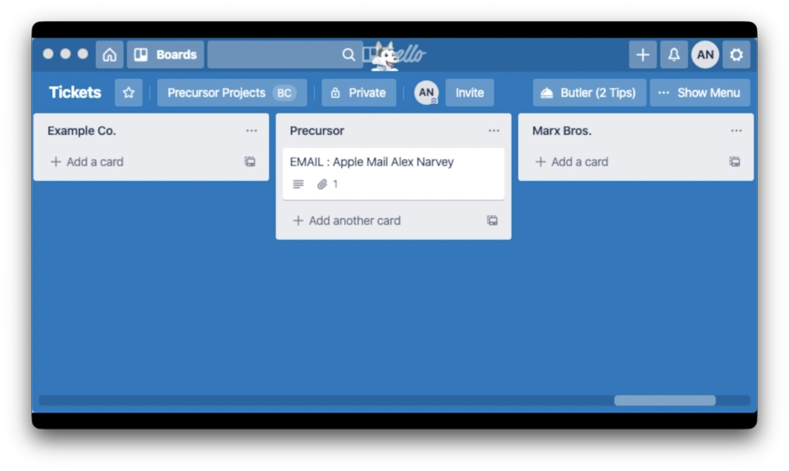

# Trello Zendesk Triage Board

> v. 2.0.0
> September 4, 2026 
> Alex Narvey / Precursor.ca  

This recipe (in the Rich Text file) shows how to integrate a Trello board with Zendesk to auto-populate a Trello board with tickets from multiple organizations and automatically remove those tickets when solved.

Allows a help desk worker to prioritize work.

This is based on work I did for the MDOYVR 2020 conference presentation.

In 2020 Zendesk used API keys. However, Zendesk has now moved to OAUTH and has changed its Admin dashboard for webhooks. This 2.0 version of the recipe is modernized for Zendesk OAUTH.

History
2.0 Sept 2026 modernized for Zendesk OAUTH
1.0 June 2020 presented at MDOYVR 2020
